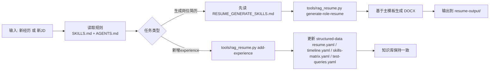
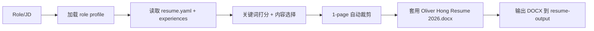

# Oliver-RAG

一个用于维护 Oliver 个人知识库并自动生成岗位定制简历（DOCX）的项目。

## 这个项目能做什么

- 维护个人 RAG 知识库（经历、技能、项目、教育、结构化数据）
- 新增 experience 时自动同步到核心数据文件
- 按岗位 JD 生成 1-page 定制简历（严格基于主模板）
- 自动输出到 `resume-output/`，并按规则命名

## 你最先要看的 3 个规范文件

- `SKILLS.md`：全局 RAG 变更规范
- `AGENTS.md`：执行入口规则
- `RESUME_GENERATE_SKILLS.md`：简历生成前置规则（必须先读）

## 项目结构（直白版）

- `oliver-knowledge-base/`：知识库内容
- `oliver-knowledge-base/structured-data/`：简历真源数据（最重要）
- `tools/`：自动化脚本
- `resume-output/`：所有生成出来的简历
- `Oliver Hong Resume 2026.docx`：主模板（格式基准）

## 流程图（总览）



## 简历生成流程图（重点）



## 常用命令

### 1) 新增一段 experience（结构化 JSON）

```bash
python3 tools/rag_resume.py add-experience --payload /absolute/path/new_experience.json
```

### 2) 生成岗位定制简历

```bash
python3 tools/rag_resume.py generate-role-resume --role "investment banking"
```

```bash
python3 tools/rag_resume.py generate-role-resume --role "associate investment analyst refg"
```

## 输出命名规则

当前命名规则（金融投递友好）：

- `YYYYMMDD_Oliver_Hong_Resume_<RoleTitle>.docx`
- 同一天同岗位重复生成会自动加后缀：`_02`、`_03`

示例：

- `20260302_Oliver_Hong_Resume_Associate_Investment_Analyst_Refg.docx`

## 真源原则（非常重要）

如果要改简历事实，请优先改：

- `oliver-knowledge-base/structured-data/resume.yaml`

然后再同步到叙事文档（experiences/skills/projects/...）。

## 一句话维护规则

- 改任何内容前先读规范文件
- 改动后要过一致性检查
- 生成简历必须走 `tools/rag_resume.py`
